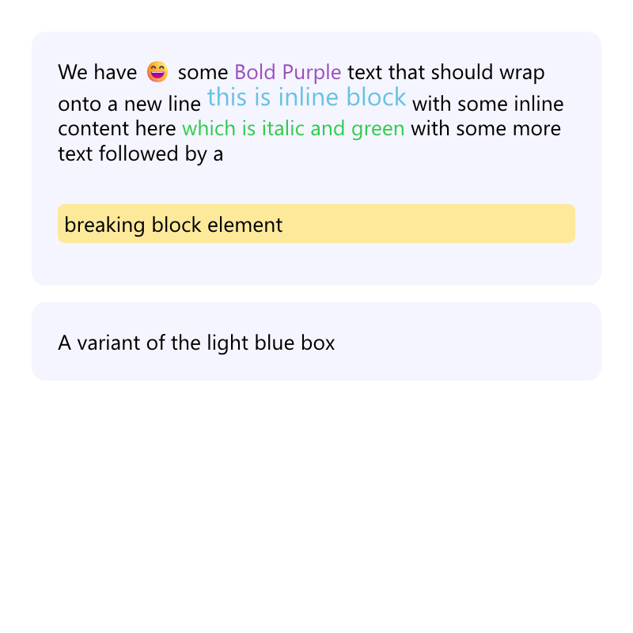

# Flexml

A simple human friendly document rendering language with support for flexible layout.


Goals:
* Geared toward receipts, invoices and reports that typically use html or a headless browser to render
* Simple style definitions
* Every unit based on base font size (padding, spacing, line height etc)
* Simple styling that is defined at the start of the document (Reducing complexity and memory use)
* Cascading styles 
* Everything is a style and styles are simple names with possible single arguments (no padding: 10 10 10 10 type of thing)
* Support images (Bitmap and SVG)
* Human friendly markup that is easy to use for basic features but can have more advanced markup
* Pages (Width/Height/Density) provided outside of the markup (render multiple versions at different sizes)
* Simple tag elements like <CurrentPage> <TotalPages> <NewPage> and flex grow container <->
* Nested boxes with box model, flex, table and inline
* Repeatable headers and footers that can be changed i.e. after a <NewPage> tag
* Zero interactivity (With the exception of maybe links for certain formats)
* Image and Html rendering initially (Html rendering for easier early renders)
* Possibly add barcode and qr rendering in the future


# Warning

Project is in EXTREMELY early state, but code and RFC docs will be pushed to the main branch regularly.

# Early Progress

This flexml example renders the image below the code. This is a very early rendering and is lacking quite a bit.

- PAGE style sets up the page width and height.
- Styles define the look and use the Cascading additive style sheets.
- Style forwarding is not implemented yet
- We are using Parley for text layout, and are awaiting vertical alignment features
- Whitespace handling is still incomplete

```
{PAGE =
    width: 5in +
    height: 5in
}

{lightBlueBox =
    bgColor: #0000FF0A +
    padding: 20px +
    width: 250px +
    borderRadius: 10px
}

{bold = italic + color: #9a50ba}

{italic = italic + color: #2fcc4e}

{inline = display: inline-block + fontSize: 1.1em + color: #68c2e3 + bg: #fce99a}

{box = box + bg: #fce99a + color: #000000 + padding: 5px + borderRadius: 5px + marginTop: 15px }

[lightBlueBox
    We have 😄 some [bold Bold Purple ] text that should wrap onto a new line
    [inline this is inline block]
    with some inline content here [italic which is italic and green ]
    with some more text followed by a
    [box breaking block element]
]

[lightBlueBox + bgColor: #abedd7
    A variant of the light blue box
]
```



# Flexml Spec

See the RFC in the wiki for more details

```
{ redBox = 
    colorText: red
    pad: 2
}

{ header = bold + sizeText: 2  }

[redBox This box will be red with some padding ]

This is some text [ This is in a box ] and [ Some more ]

[flex
    [ Some text on the left ] <-> [Some text on the right ]
]

[table
    [header [ a column ] [ a column ] ]
    [ [ a column ] [ a column ] ]
    [ [ a column ] [ a column ] ]
]

This is some raw |= text that can have [ literal text in it ] =|

[bold + italic
  A box with text in it
]

[small + 
 large +
 italic
  This is a box with text [ And another ] 
]
```
